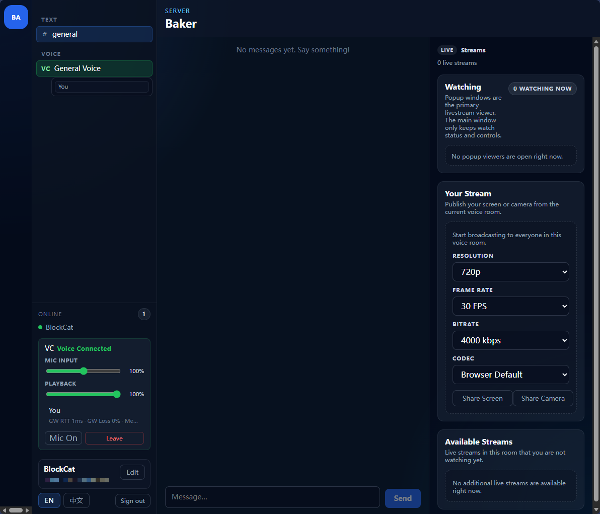

<p align="right">
  <a href="./README.zh-CN.md">
    
  </a>
</p>

**[点此查看中文](./README.zh-CN.md)**

# Baker

Baker is a self-hosted, Discord-like realtime communication platform for private communities, game groups, and small teams.

It supports browser-based text chat, low-latency voice rooms, and in-room game or screen sharing without requiring users to install a dedicated client. Deploy the server once, open it in a modern browser, and your users can join immediately.

Because voice, microphone, camera, and screen sharing rely on secure browser media APIs, Baker should be served over HTTPS in real deployments.

The project name is inspired by Baker from Arknights: Endfield.



## Project Direction

- Self-hosted first, with deployment-friendly defaults
- Admin-controlled server settings and instance ownership
- Stable realtime chat, voice, and room streaming behavior
- Incremental delivery instead of platform-wide redesigns

## Current Status

- Release line: `1.0.0`
- Validated through the current Milestone 5 hardening stage
- Monorepo includes the web client, desktop shell, admin panel, API, gateway, and media boundary services
- Auth, chat, presence, voice, livestream signaling, popup stream viewing, and server settings are implemented
- `blockcat233/baker` is now the only supported public deployment image
- Standard validation loop is `pnpm typecheck`, `pnpm lint`, and `pnpm test`

## Start Here If You Are New

If your real goal is "I want my own small Discord-like server without learning the whole codebase first," follow this order:

1. Read the [Beginner Deployment Guide](docs/beginner-deployment.md).
2. Run the single-container command from this README.
3. Confirm chat works.
4. Test voice and livestream with a second browser or second user.
5. Add HTTPS and TURN only when you move to real internet users.

## Quick Start: One Container

The fastest way to try Baker is a single container with one persistent data volume.

```bash
docker volume create baker-data

docker run -d \
  --name baker \
  -p 3000:80 \
  -p 3001:8080 \
  -v baker-data:/var/lib/baker \
  blockcat233/baker:1.0.0

docker logs baker
```

Open:

- Web: `http://localhost:3000`
- Admin: `http://localhost:3001`

The first boot prints the admin password once. All runtime secrets, Redis data, and PostgreSQL data live under `/var/lib/baker` inside the mounted volume, so a simple `docker restart baker` keeps the instance intact.

If you want to follow the newest rolling image instead of pinning this release, replace `1.0.0` with `latest`.

### Docker Desktop Walkthrough

If you prefer Docker Desktop instead of the command line, use these exact values in the container creation form:

- Image: `blockcat233/baker:1.0.0`
- Container name: `baker` or `baker-test`
- Ports:
  - host `3000` -> container `80/tcp`
  - host `3001` -> container `8080/tcp`
- Leave these container ports empty unless you explicitly need a TURN relay or direct database debugging:
  - `3478/tcp`
  - `3478/udp`
  - `5432/tcp`
- Volume:
  - source / volume name: `baker-data`
  - container path: `/var/lib/baker`
- Environment variables: leave empty for the default local setup

After the container starts:

1. Open `http://localhost:3000`
2. Open `http://localhost:3001`
3. Read the initial admin password from:
   `docker logs baker`

If `3000` or `3001` is already in use on your machine, change them to another pair such as `13000 -> 80` and `13001 -> 8080`, then open `http://localhost:13000` and `http://localhost:13001`.

### Common Mistake

If Docker Desktop shows the container as running but `http://localhost:3000` and `http://localhost:3001` do not open, the usual cause is missing host-port mappings.

You must publish:

- host `3000` -> container `80`
- host `3001` -> container `8080`

If those host-side ports are blank, Baker is only listening inside the container and will not be reachable from your browser.

## Optional TURN Relay

For internet-facing voice or livestream usage across NAT, VPN, mobile, or cross-region networks, enable the bundled TURN server in the same container and publish the relay ports:

```bash
docker rm -f baker

docker run -d \
  --name baker \
  -p 3000:80 \
  -p 3001:8080 \
  -p 3478:3478/tcp \
  -p 3478:3478/udp \
  -p 49160-49200:49160-49200/tcp \
  -p 49160-49200:49160-49200/udp \
  -e TURN_ENABLED=true \
  -e TURN_EXTERNAL_IP=203.0.113.10 \
  -e TURN_USERNAME=baker \
  -e TURN_PASSWORD=change-this \
  -v baker-data:/var/lib/baker \
  blockcat233/baker:1.0.0
```

If `TURN_URLS` is not set, Baker automatically derives it from `TURN_EXTERNAL_IP` and `TURN_PORT`. If you prefer an explicit relay hostname, set `TURN_URLS` yourself.

For public internet deployments, treat these as mandatory requirements, not optional tuning:

- Publish `3478` and `49160-49200` for both TCP and UDP.
- Set `TURN_EXTERNAL_IP` to the server's public IP, or explicitly set `TURN_URLS` to public TURN addresses that browsers can reach.
- Keep `TURN_USERNAME` and `TURN_PASSWORD` configured together with the relay address.

When `TURN_ENABLED=true`, Baker now fails fast at startup if it cannot determine a public TURN relay address for clients. After restarting the container, confirm the media session logs show `turnConfigured:true` before testing cross-region voice or livestream playback.

## Deployment Notes

- Public deployment is intentionally documented as a single-image path only: `blockcat233/baker`
- For browser voice, microphone, camera, and screen sharing, serve Baker over HTTPS
- TURN is optional for small/local setups but strongly recommended for public internet, mobile, VPN, or cross-region usage
- When TURN is enabled for public deployment, you must expose the relay ports and provide either `TURN_EXTERNAL_IP` or explicit `TURN_URLS`
- `docker-compose.yml` remains in the repo for local development infrastructure (`postgres`, `redis`, optional `turn`), not as a second public deployment product

## Current Limits

- `apps/media` is still a placeholder adapter boundary; there is no real SFU backend yet
- Voice and stream room runtime state is still in-memory
- Voice and livestream are P2P and intended for small-room usage today
- Desktop/Electron is present but not yet validated end-to-end

## Monorepo Layout

```text
apps/
  admin/     Server control panel
  api/       Durable HTTP API
  desktop/   Electron shell
  gateway/   Realtime WebSocket gateway
  media/     Media adapter boundary
  web/       Browser client
packages/
  client/    Shared React UI and app shell
  db/        Drizzle schema and repositories
  protocol/  Shared DTO / WS / signaling contracts
  sdk/       Client transport and WebRTC helpers
  shared/    Env, logger, and shared utilities
docs/        Architecture, history, status, and decisions
```

## Local Development

1. Install dependencies with `pnpm install`.
2. Start local services with `powershell -NoProfile -ExecutionPolicy Bypass -File scripts/dev-up.ps1`.
3. Optional HTTPS proxy for mobile mic/voice testing:
   `powershell -NoProfile -ExecutionPolicy Bypass -File scripts/dev-https.ps1`
4. Optional DB reset:
   `powershell -NoProfile -ExecutionPolicy Bypass -File scripts/dev-reset-db.ps1 -Force`
5. Start the desktop shell separately with `pnpm dev:desktop`.

## Validation

- `pnpm typecheck`
- `pnpm lint`
- `pnpm test`

## Documentation

- [Beginner Deployment Guide](docs/beginner-deployment.md)
- [Beginner Deployment Guide (Chinese)](docs/beginner-deployment.zh-CN.md)
- [Chinese Guide / 中文说明](./README.zh-CN.md)
- [Project Overview](docs/project-overview.md)
- [Current Status](docs/current-status.md)
- [Project History](docs/project-history.md)
- [Architecture](docs/architecture.md)
- [Repository State Summary](docs/repo-state-summary.md)

## Contributing

Issues and pull requests in English or Simplified Chinese are welcome.

Before contributing, please read:

- [CONTRIBUTING.md](CONTRIBUTING.md)
- [SECURITY.md](SECURITY.md)
- [CODE_OF_CONDUCT.md](CODE_OF_CONDUCT.md)
