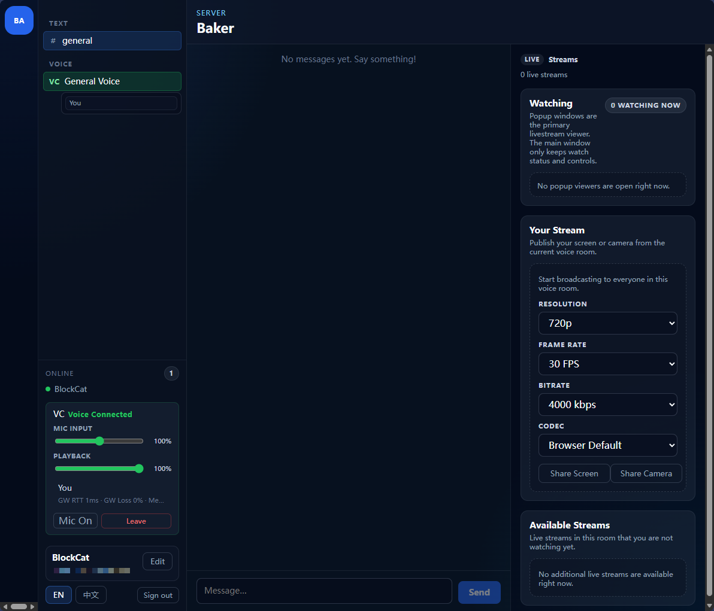

<p align="right">
  <a href="./README.zh-CN.md">
    
  </a>
</p>

**[点此查看中文](./README.zh-CN.md)**

# Baker

Baker is a self-hosted, Discord-like realtime communication platform for private communities, game groups, and small teams.

It supports browser-based text chat, low-latency voice rooms, and in-room game or screen sharing without requiring users to install a dedicated client. Deploy the server once, open it in a modern browser, and your users can join immediately.

Because voice, microphone, camera, and screen sharing rely on secure browser media APIs, Baker should be served over HTTPS in real deployments.

The project name is inspired by Baker from Arknights: Endfield.



## Project Direction

- Self-hosted first, with deployment-friendly defaults
- Admin-controlled server settings and instance ownership
- Stable realtime chat, voice, and room streaming behavior
- Incremental delivery instead of platform-wide redesigns

## Current Status

- Release line: server `1.0.14`; desktop client `1.0.14a`
- Validated through the current Milestone 5 hardening stage
- Monorepo includes the web client, desktop shell, admin panel, API, gateway, and media boundary services
- Auth, chat, presence, voice, livestream signaling, popup stream viewing, and server settings are implemented
- `blockcat233/baker` is now the only supported public deployment image
- Standard validation loop is `pnpm typecheck`, `pnpm lint`, and `pnpm test`

## Versioning

- Stable server releases use numeric tags such as `1.0.14`; server beta releases may use compact labels such as `1.0.14beta.1`. The matching Docker image is `blockcat233/baker:<version>`.
- Client release labels follow the server version plus a letter, starting at `a`: `1.0.9a`, `1.0.9b`, and so on.
- Client-only updates advance the trailing letter. Server releases advance the numeric version and reset the client letter to `a`.
- Package metadata stays semver-compatible for tooling. Stable server labels such as `1.0.14` are stored directly in `package.json`; beta labels such as `1.0.14beta.1` are stored as `1.0.14-beta.1`.
- Before tagging a release, run `pnpm release:check` and follow the [Release Checklist](docs/release-checklist.md).

## Start Here If You Are New

If your real goal is "I want my own small Discord-like server without learning the whole codebase first," follow this order:

1. Read the [Beginner Deployment Guide](docs/beginner-deployment.md).
2. Run the single-container command from this README.
3. Confirm chat works.
4. Test voice and livestream with a second browser or second user.
5. Add HTTPS and TURN only when you move to real internet users.

## Quick Start: One Container

The fastest way to try Baker is a single container with one persistent data volume.

```bash
docker volume create baker-data

docker run -d \
  --name baker \
  -p 3000:80 \
  -p 3001:8080 \
  -v baker-data:/var/lib/baker \
  -v /var/run/docker.sock:/var/run/docker.sock \
  blockcat233/baker:1.0.14

docker logs baker
```

Open:

- Web: `http://localhost:3000`
- Admin: `http://localhost:3001`

The first boot prints the admin password once. All runtime secrets, Redis data, and PostgreSQL data live under `/var/lib/baker` inside the mounted volume, so a simple `docker restart baker` keeps the instance intact.

If you want to follow the newest rolling image instead of pinning this release, replace `1.0.14` with `latest`.

The public deployment guide assumes this all-in-one image. It contains PostgreSQL, Redis, API, Gateway, Media, Caddy, optional coturn, the runtime watchdog, and `supervisorctl` in one container. Admin runtime repair, self-repair, public IP automation restarts, and deployment-settings apply all depend on that supervisor environment. If you run split services manually, Baker can still serve traffic, but you must provide your own process supervision and restart Media/TURN after runtime config changes.

The Docker socket mount is required for the admin panel's one-click update, deployment-settings apply, and container-level repair fallback. Without it, Baker still runs normally, and the admin panel can still inspect and restart bundled services through the all-in-one supervisor, but image updates and container rebuilds must be performed manually from the Docker host.

## Admin One-Click Updates

When `/var/run/docker.sock` is mounted, the admin panel can:

- fetch available Baker image tags from Docker Hub
- start an update helper container from the current image
- pull the selected target image
- recreate the Baker container while preserving the `/var/lib/baker` data volume, container name, restart policy, and managed port mappings
- roll back automatically if the replacement container fails its health check

If the server can only reach GitHub or Docker Hub metadata through a proxy, configure **Update Proxy** in the Server Updates card. This setting is stored in `/var/lib/baker/runtime/update-proxy.json` and is used only for Baker update metadata requests. Public IP automation does not use it. Docker image pulls are still performed by the host Docker daemon through `/var/run/docker.sock`; if image downloads fail, configure the Docker daemon proxy or a registry mirror on the Docker host.

The admin panel also exposes selected deployment settings that previously required changing Docker arguments manually: Web/Admin host ports, allowed hosts, STUN URLs, TURN enablement and relay ports, TURN credentials, SFU announced IP, and SFU RTC port ranges. Password fields are write-only and are never returned by the API.

## Runtime Status and Self-Repair

The admin panel includes a runtime status card for the all-in-one container. It checks PostgreSQL, Redis, API, Gateway, Media, Caddy Web/Admin routing, and the optional TURN relay. TURN is shown as disabled when `TURN_ENABLED=false` and is not treated as a failure.

If a bundled service is unhealthy, use **Repair Services** to restart only the affected supervisor programs in dependency order. When Docker socket access is mounted and container fallback repair is enabled, Baker can also start the same update helper used by deployment applies to rebuild the current container from its current image without pulling a new tag.

Self-repair mode stores its settings under `/var/lib/baker/runtime` and continues running inside the container even when the admin page is closed. The default interval is 60 seconds, and it can be adjusted from 30 seconds to 24 hours.

The same runtime card also includes public IP automation. When enabled, Baker periodically detects the server's current public IP and keeps the managed TURN/SFU media addresses current. If the IP changes, it updates the persistent runtime config and restarts only the affected Media/TURN supervisor services. This does not replace port publishing, HTTPS, or TURN credentials; those still need to be configured correctly.

Baker tries several public IP endpoints by default, including endpoints that are commonly reachable from mainland China: `https://ip.3322.net`, `https://myip.ipip.net`, and `https://ifconfig.co/ip`, followed by `api.ipify.org`, `ifconfig.me`, and `checkip.amazonaws.com`. If your server cannot reach one or more defaults, override the list with `BAKER_PUBLIC_IP_ENDPOINTS` as a comma-separated list. Endpoints may return plain text, JSON like `{"ip":"203.0.113.10"}`, or localized text that contains an IP address.

### Docker Desktop Walkthrough

If you prefer Docker Desktop instead of the command line, use these exact values in the container creation form:

- Image: `blockcat233/baker:1.0.14`
- Container name: `baker` or `baker-test`
- Ports:
  - host `3000` -> container `80/tcp`
  - host `3001` -> container `8080/tcp`
- Leave these container ports empty unless you explicitly need a TURN relay or direct database debugging:
  - `3478/tcp`
  - `3478/udp`
  - `5432/tcp`
- Volume:
  - source / volume name: `baker-data`
  - container path: `/var/lib/baker`
- Optional bind mount for one-click updates:
  - source: `/var/run/docker.sock`
  - container path: `/var/run/docker.sock`
- Environment variables: leave empty for the default local setup

After the container starts:

1. Open `http://localhost:3000`
2. Open `http://localhost:3001`
3. Read the initial admin password from:
   `docker logs baker`

If `3000` or `3001` is already in use on your machine, change them to another pair such as `13000 -> 80` and `13001 -> 8080`, then open `http://localhost:13000` and `http://localhost:13001`.

### Common Mistake

If Docker Desktop shows the container as running but `http://localhost:3000` and `http://localhost:3001` do not open, the usual cause is missing host-port mappings.

You must publish:

- host `3000` -> container `80`
- host `3001` -> container `8080`

If those host-side ports are blank, Baker is only listening inside the container and will not be reachable from your browser.

## Optional TURN Relay

For internet-facing voice or livestream usage across NAT, VPN, mobile, or cross-region networks, enable the bundled TURN server in the same container and publish the relay ports:

```bash
docker rm -f baker

docker run -d \
  --name baker \
  -p 3000:80 \
  -p 3001:8080 \
  -p 3478:3478/tcp \
  -p 3478:3478/udp \
  -p 49160-49200:49160-49200/tcp \
  -p 49160-49200:49160-49200/udp \
  -e TURN_ENABLED=true \
  -e TURN_EXTERNAL_IP=203.0.113.10 \
  -e TURN_USERNAME=baker \
  -e TURN_PASSWORD=change-this \
  -e BAKER_PUBLIC_IP_ENDPOINTS='https://ip.3322.net,https://myip.ipip.net,https://ifconfig.co/ip,https://api.ipify.org?format=json' \
  -v baker-data:/var/lib/baker \
  -v /var/run/docker.sock:/var/run/docker.sock \
  blockcat233/baker:1.0.14
```

If `TURN_URLS` is not set, Baker automatically derives it from `TURN_EXTERNAL_IP` and `TURN_PORT`. If you prefer an explicit relay hostname, set `TURN_URLS` yourself.

In the all-in-one image, `TURN_EXTERNAL_IP`, `TURN_URLS`, and `SFU_ANNOUNCED_IP` from Docker env are only bootstrap seeds for the first `runtime.env`. After `/var/lib/baker/runtime/runtime.env` exists, that file is authoritative for these media addresses; the admin panel and Public IP Automation update it and then restart Media/TURN through `supervisorctl`. If the server public IP changes, update the admin/runtime settings instead of relying on stale Docker env values.

For public internet deployments, treat these as mandatory requirements, not optional tuning:

- Publish `3478` and `49160-49200` for both TCP and UDP.
- Set `TURN_EXTERNAL_IP` to the server's public IP, or explicitly set `TURN_URLS` to public TURN addresses that browsers can reach.
- Keep `TURN_USERNAME` and `TURN_PASSWORD` configured together with the relay address.

When `TURN_ENABLED=true`, Baker now fails fast at startup if it cannot determine a public TURN relay address for clients. After restarting the container, confirm the media session logs show `turnConfigured:true` before testing cross-region voice or livestream playback.

If your VPS or home network public IP can change, enable **Runtime Status -> Public IP Automation** in the admin panel after TURN/SFU is configured. Baker will refresh `TURN_EXTERNAL_IP`, auto-generated `TURN_URLS`, and configured `SFU_ANNOUNCED_IP` when the detected public IP changes.

## Optional SFU Media Mode

Baker defaults to P2P media. TURN helps P2P peers reach each other through strict NATs, but browsers still try to form peer connections between users. SFU mode sends voice and livestream tracks through the built-in media backend, which is often more stable for users on restrictive networks.

To make SFU mode available, publish the RTC port range and set the public IP browsers can reach:

```bash
docker run -d \
  --name baker \
  -p 3000:80 \
  -p 3001:8080 \
  -p 50000-50100:50000-50100/udp \
  -p 50000-50100:50000-50100/tcp \
  -e SFU_ANNOUNCED_IP=203.0.113.10 \
  -v baker-data:/var/lib/baker \
  -v /var/run/docker.sock:/var/run/docker.sock \
  blockcat233/baker:1.0.14
```

Then open the admin panel and switch **Server settings -> Media mode** from `p2p` to `sfu`. The switch immediately rebuilds current voice and livestream media sessions while keeping chat WebSocket connections online. If the SFU public IP or port range is missing, the admin API rejects the switch instead of silently falling back to P2P.

### Dual-Region Media Profiles

Advanced deployments can expose the same Baker media service through more than one public network path. Set `MEDIA_REGION_PROFILES` to a JSON array. Gateway selects a profile from the WebSocket `Host`, `X-Forwarded-Host`, or `Origin` header, then Media uses that profile's ICE/TURN/SFU addresses for voice, music share, and livestream sessions.

Example:

```bash
MEDIA_REGION_PROFILES='[
  {
    "id": "mainland",
    "hosts": ["violet.evergarden.space"],
    "sfuAnnouncedIp": "113.80.68.23",
    "sfuRtcMinPort": 50000,
    "sfuRtcMaxPort": 50100,
    "turnUrls": [
      "turn:violet.evergarden.space:3478?transport=udp",
      "turn:violet.evergarden.space:3478?transport=tcp"
    ]
  },
  {
    "id": "hongkong",
    "hosts": ["hkserver.evergarden.space"],
    "sfuAnnouncedIp": "168.70.50.141",
    "sfuRtcMinPort": 23335,
    "sfuRtcMaxPort": 23400,
    "turnUrls": [
      "turn:hkserver.evergarden.space:23304?transport=udp",
      "turn:hkserver.evergarden.space:23304?transport=tcp"
    ]
  }
]'
```

Profile fields inherit the legacy global values when omitted: `STUN_URLS`, `TURN_URLS`, `TURN_USERNAME`, `TURN_PASSWORD`, `SFU_ANNOUNCED_IP`, `SFU_RTC_MIN_PORT`, `SFU_RTC_MAX_PORT`, and `SFU_ENABLE_TCP`.

For SFU media, the announced address and candidate port must both be reachable by the browser. If you use frp or another TCP/UDP forwarder, map the remote RTC ports to the same local port numbers, or change Baker's profile port range to match the remote ports. A remote `23335 -> local 50000` mapping will not work for SFU candidates because the browser would still receive port `50000`.

Operational notes:

- Mainland users should open the mainland web host, for example `https://violet.evergarden.space/`.
- Overseas users should open the overseas web host, for example `https://hkserver.evergarden.space:23303/` unless the relay server also exposes standard `443/tcp`.
- `MEDIA_REGION_PROFILES` is stored in `runtime.env` after first boot and can be edited from **Deployment Settings -> Media Region Profiles JSON** in the admin panel.
- Public IP Automation only manages the legacy global TURN/SFU values. Multi-region profile addresses are intentional static routes and must be updated explicitly when a relay IP or port range changes.
- The web entry, TURN relay, and SFU RTC ports may use different published ports, but every SFU candidate port announced in a profile must be reachable at that same number from the user's browser.

## Deployment Notes

- Public deployment is intentionally documented as a single-image path only: `blockcat233/baker`
- Public deployment assumes the all-in-one supervisor image. Do not use the local-development `docker-compose.yml` as a public deployment path unless you also provide equivalent service supervision and restart hooks.
- For browser voice, microphone, camera, and screen sharing, serve Baker over HTTPS
- TURN is optional for small/local setups but strongly recommended for public internet, mobile, VPN, or cross-region usage
- When TURN is enabled for public deployment, you must expose the relay ports and provide either `TURN_EXTERNAL_IP` or explicit `TURN_URLS`
- SFU mode requires `SFU_ANNOUNCED_IP` or at least one `MEDIA_REGION_PROFILES` entry with `sfuAnnouncedIp`, plus the configured TCP/UDP RTC port range, to be reachable from browsers
- If the server's public IP may change, enable public IP automation in the admin panel so media addresses are refreshed automatically
- If the public IP check fails from your server network, set `BAKER_PUBLIC_IP_ENDPOINTS` to endpoints reachable from that region.
- `docker-compose.yml` remains in the repo for local development infrastructure (`postgres`, `redis`, optional `turn`), not as a second public deployment product

## Current Limits

- SFU mode is single-node and does not include recording, transcoding, HLS, or simulcast yet
- Voice and stream room runtime state is still in-memory
- P2P remains the default and fallback deployment path
- Desktop/Electron is present, desktop screen livestream publishing has been validated end-to-end against the web viewer, and the desktop picker now supports window/screen previews plus Windows excluded-system-audio sharing

## Monorepo Layout

```text
apps/
  admin/     Server control panel
  api/       Durable HTTP API
  desktop/   Electron shell
  gateway/   Realtime WebSocket gateway
  media/     Media adapter boundary
  web/       Browser client
packages/
  client/    Shared React UI and app shell
  db/        Drizzle schema and repositories
  protocol/  Shared DTO / WS / signaling contracts
  sdk/       Client transport and WebRTC helpers
  shared/    Env, logger, and shared utilities
docs/        Architecture, history, status, and decisions
```

## Local Development

1. Install dependencies with `pnpm install`.
2. Start local services with `powershell -NoProfile -ExecutionPolicy Bypass -File scripts/dev-up.ps1`.
3. Optional HTTPS proxy for mobile mic/voice testing:
   `powershell -NoProfile -ExecutionPolicy Bypass -File scripts/dev-https.ps1`
4. Optional DB reset:
   `powershell -NoProfile -ExecutionPolicy Bypass -File scripts/dev-reset-db.ps1 -Force`
5. Start the desktop shell separately with `pnpm dev:desktop`.

## Validation

- `pnpm typecheck`
- `pnpm lint`
- `pnpm test`

## Documentation

- [Beginner Deployment Guide](docs/beginner-deployment.md)
- [Beginner Deployment Guide (Chinese)](docs/beginner-deployment.zh-CN.md)
- [Chinese Guide / 中文说明](./README.zh-CN.md)
- [Project Overview](docs/project-overview.md)
- [Current Status](docs/current-status.md)
- [Project History](docs/project-history.md)
- [Architecture](docs/architecture.md)
- [Repository State Summary](docs/repo-state-summary.md)

## Contributing

Issues and pull requests in English or Simplified Chinese are welcome.

Before contributing, please read:

- [CONTRIBUTING.md](CONTRIBUTING.md)
- [SECURITY.md](SECURITY.md)
- [CODE_OF_CONDUCT.md](CODE_OF_CONDUCT.md)
