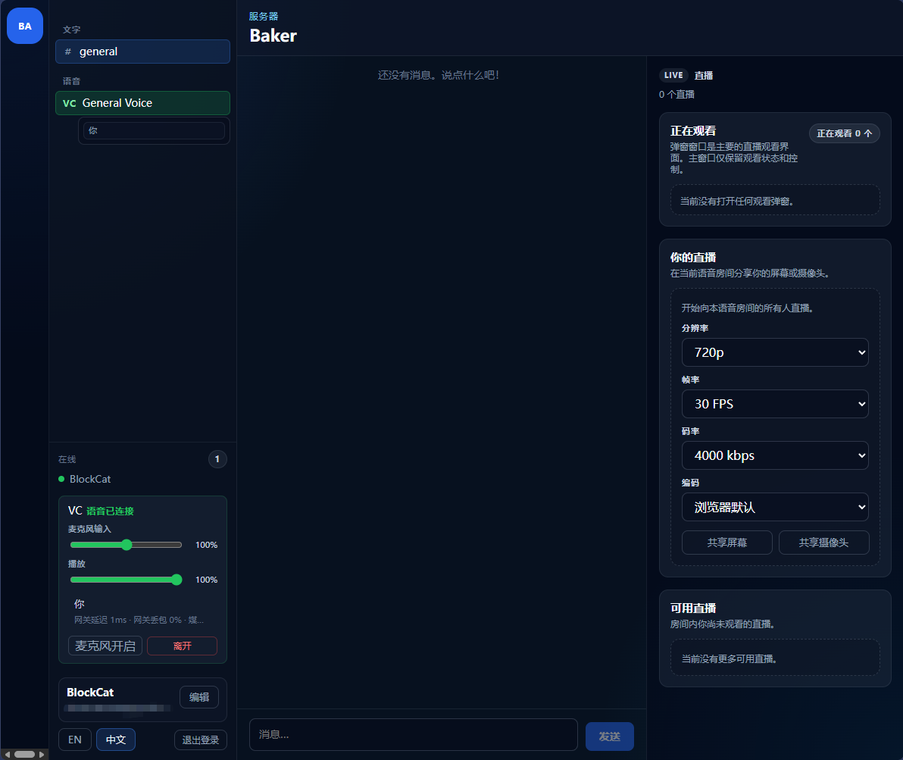

<p align="right">
  <a href="./README.md">
    
  </a>
</p>

# Baker

Baker 是一个面向私有部署场景、体验方向接近 Discord 的实时通信平台，适合私有社区、游戏群组和小团队。

它支持浏览器中的文字聊天、低延迟语音房间，以及房间内的游戏/屏幕共享，不需要额外安装专用客户端。只要部署这一套服务端，用户直接用现代浏览器打开即可加入。

由于语音、麦克风、摄像头和屏幕共享依赖浏览器的安全媒体 API，正式部署时应该通过 HTTPS 提供服务。

项目名 Baker 取自《明日方舟：终末地》中的 Baker。



## 项目方向

- 自托管优先，保持部署友好
- 强调实例所有权和管理员控制
- 优先保证聊天、语音和房间直播的实时稳定性
- 采用小步迭代，而不是整个平台级重构

## 当前状态

- 当前发布线：`1.0.0`
- 当前已经完成并验证到 Milestone 5 的稳定性与部署加固阶段
- 单仓库包含 Web、桌面壳层、管理后台、API、Gateway 和 Media 边界服务
- 已实现认证、聊天、在线状态、语音、直播信令、弹窗观看和服务端设置
- `blockcat233/baker` 现在是唯一官方支持的公开部署镜像
- 标准校验流程为 `pnpm typecheck`、`pnpm lint`、`pnpm test`

## 如果你是新手，请先看这里

如果你的真实目标是“先尽快搭一个自己的小型 Discord 类服务器”，建议按这个顺序来：

1. 先读 [新手部署指南](docs/beginner-deployment.zh-CN.md)。
2. 直接运行本 README 里的单容器命令。
3. 先确认文字聊天正常。
4. 再用第二个浏览器或第二个用户测试语音和直播。
5. 只有在准备给公网用户用的时候，再补 HTTPS 和 TURN。

## 快速开始：单容器

体验 Baker 最简单的方式是直接运行一个容器，并挂载一个持久化数据卷。

```bash
docker volume create baker-data

docker run -d \
  --name baker \
  -p 3000:80 \
  -p 3001:8080 \
  -v baker-data:/var/lib/baker \
  blockcat233/baker:1.0.0

docker logs baker
```

打开：

- Web：`http://localhost:3000`
- 管理后台：`http://localhost:3001`

首次启动会打印一次管理后台密码。运行时密钥、Redis 数据和 PostgreSQL 数据都会保存在挂载卷里的 `/var/lib/baker` 下，因此后续直接 `docker restart baker` 就能保留实例状态。

如果你想始终跟随最新滚动版本，也可以把 `1.0.0` 换成 `latest`。

### Docker Desktop 图形界面填写示例

如果你更喜欢用 Docker Desktop 图形界面，而不是命令行，请按下面这些值填写：

- 镜像：`blockcat233/baker:1.0.0`
- 容器名：`baker` 或 `baker-test`
- 端口：
  - 宿主机 `3000` -> 容器 `80/tcp`
  - 宿主机 `3001` -> 容器 `8080/tcp`
- 下面这些端口先不要填，除非你明确需要 TURN 中继或数据库调试：
  - `3478/tcp`
  - `3478/udp`
  - `5432/tcp`
- 数据卷：
  - source / volume name：`baker-data`
  - container path：`/var/lib/baker`
- 环境变量：本地默认体验时先全部留空

示例截图：


容器启动后：

1. 打开 `http://localhost:3000`
2. 打开 `http://localhost:3001`
3. 用下面这条命令读取首次启动打印出来的管理后台密码：
   `docker logs baker`

如果你机器上的 `3000` 或 `3001` 已经被占用，可以改成例如 `13000 -> 80`、`13001 -> 8080`，然后访问 `http://localhost:13000` 和 `http://localhost:13001`。

### 最常见的错误

如果 Docker Desktop 里显示容器正在运行，但 `http://localhost:3000` 和 `http://localhost:3001` 打不开，最常见原因就是没有填写宿主机端口映射。

必须发布：

- 宿主机 `3000` -> 容器 `80`
- 宿主机 `3001` -> 容器 `8080`

如果左侧宿主机端口留空，Baker 就只会监听在容器内部，浏览器当然访问不到。

## 可选：启用 TURN 中继

如果你要在公网、复杂 NAT、VPN、移动网络或跨地区环境下使用语音和直播，建议在同一个容器里启用内置 TURN，并映射中继端口：

```bash
docker rm -f baker

docker run -d \
  --name baker \
  -p 3000:80 \
  -p 3001:8080 \
  -p 3478:3478/tcp \
  -p 3478:3478/udp \
  -p 49160-49200:49160-49200/tcp \
  -p 49160-49200:49160-49200/udp \
  -e TURN_ENABLED=true \
  -e TURN_EXTERNAL_IP=203.0.113.10 \
  -e TURN_USERNAME=baker \
  -e TURN_PASSWORD=change-this \
  -v baker-data:/var/lib/baker \
  blockcat233/baker:1.0.0
```

如果没有显式设置 `TURN_URLS`，Baker 会根据 `TURN_EXTERNAL_IP` 和 `TURN_PORT` 自动生成；如果你希望客户端拿到固定域名形式的 TURN 地址，也可以自己显式设置 `TURN_URLS`。

对于公网部署，这几项应视为硬性要求，而不是可选优化：

- 必须同时映射 `3478` 和 `49160-49200` 的 TCP 与 UDP 端口。
- 必须设置 `TURN_EXTERNAL_IP` 为服务器公网 IP，或者显式设置浏览器可访问的 `TURN_URLS`。
- `TURN_USERNAME` 和 `TURN_PASSWORD` 必须和公网 relay 地址一起配置。

现在只要 `TURN_ENABLED=true`，Baker 就会在无法确定客户端可用的公网 TURN relay 地址时直接启动失败，而不会再静默进入“看起来开了 TURN、实际上客户端拿不到 relay”的状态。容器重启后，建议先确认日志里出现 `turnConfigured:true`，再做跨地区语音或直播观看测试。

## 部署说明

- 对外公开部署只保留 `blockcat233/baker` 这一种单镜像方案
- 浏览器里的语音、麦克风、摄像头和屏幕共享需要 HTTPS 才能正常工作
- 对于公网、移动网络、VPN 或跨地区使用场景，建议额外启用 TURN
- 一旦在公网部署里启用 TURN，就必须暴露中继端口，并提供 `TURN_EXTERNAL_IP` 或显式 `TURN_URLS`
- 仓库里的 `docker-compose.yml` 现在只保留给本地开发基础设施使用（`postgres`、`redis`、可选 `turn`），不再作为第二套公开部署产品

## 当前限制

- `apps/media` 目前仍是占位型适配边界，还没有真正的 SFU 后端
- 语音和直播房间运行时状态目前仍以内存态为主
- 当前语音与直播仍是 P2P 方案，更适合小房间场景
- 桌面端 Electron 已接入，但尚未完成完整的端到端验证

## Monorepo 结构

```text
apps/
  admin/     服务端管理后台
  api/       持久化 HTTP API
  desktop/   Electron 桌面壳层
  gateway/   实时 WebSocket 网关
  media/     媒体适配边界
  web/       浏览器客户端
packages/
  client/    共享 React UI 与应用壳层
  db/        Drizzle schema 与仓储
  protocol/  共享 DTO / WS / 信令协议
  sdk/       客户端传输与 WebRTC 辅助
  shared/    环境、日志与共享工具
docs/        架构、历史、状态与决策记录
```

## 本地开发

1. 先执行 `pnpm install` 安装依赖。
2. 使用 `powershell -NoProfile -ExecutionPolicy Bypass -File scripts/dev-up.ps1` 启动本地服务。
3. 如果要在手机或 HTTPS 场景测试麦克风/语音，可额外运行：
   `powershell -NoProfile -ExecutionPolicy Bypass -File scripts/dev-https.ps1`
4. 如果需要重置数据库，可运行：
   `powershell -NoProfile -ExecutionPolicy Bypass -File scripts/dev-reset-db.ps1 -Force`
5. 桌面端需单独执行 `pnpm dev:desktop`。

## 校验

- `pnpm typecheck`
- `pnpm lint`
- `pnpm test`

## 文档

- [新手部署指南](docs/beginner-deployment.zh-CN.md)
- [Beginner Deployment Guide](docs/beginner-deployment.md)
- [English Guide](./README.md)
- [项目概览](docs/project-overview.md)
- [当前状态](docs/current-status.md)
- [项目历史](docs/project-history.md)
- [架构说明](docs/architecture.md)
- [仓库状态摘要](docs/repo-state-summary.md)

## 参与贡献

欢迎使用英文或简体中文提交 issue 和 pull request。

开始前请先阅读：

- [CONTRIBUTING.md](CONTRIBUTING.md)
- [SECURITY.md](SECURITY.md)
- [CODE_OF_CONDUCT.md](CODE_OF_CONDUCT.md)
